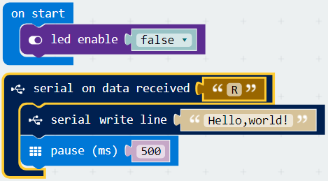
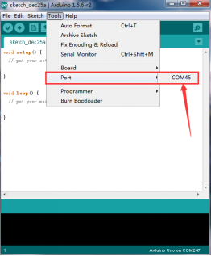
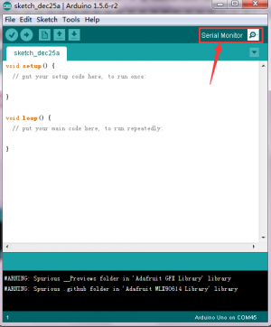
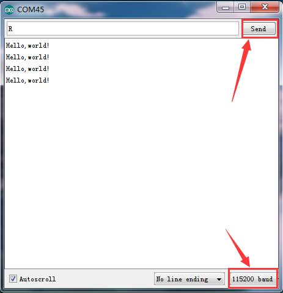

# Displaying Hello World

This is an entry level project for you to test the communication between the micro:bit and your PC.

**Note:** This project uses the Arduino IDE.

## Required Components
Quantity | Component
--- | ---
1 | micro:bit
1 | USB cable

## Coding the micro:bit

Create or download the hex file, power up the unit & upload the code. Within the Arduino IDE, set the COM port, open the serial monitor, select the baud rate 115200 (because the baud rate of a micro:bit is 115200), type “R” on the keyboard, then click “Send”. You should see the monitor display “Hello world!”. Shown below.

#### If you are having trouble coding the micro:bit, you can download a copy of the hex file below
[Download Hex File](https://github.com/Jaycar-Electronics/micro-bit-Starter-Kit/blob/master/Project%202%20-%20Blinking%20an%20LED/Blinking-LED.zip?raw=true)
