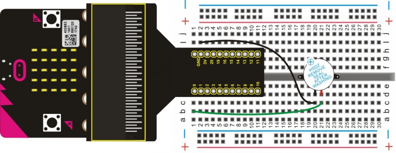
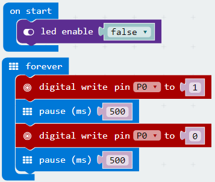

# Active Buzzer

In this lesson, we will use micro:bit to drive an active buzzer. The active buzzer has a simple oscillator circuit which can convert constant direct current into a certain frequency pulse signal. Once an active buzzer receives a high level signal, it will produce an audible beep.

## Required Components
Quantity | Component
--- | ---
1 | micro:bit
1 | T-type adapter
1 | USB cable
1 | Active buzzer
1 | Breadboard
2 | Jumper wire

## Coding the micro:bit

Create or download the hex file, power up the unit & upload the code. You should be able to hear the active buzzer beep for 0.5 seconds, then stop for 0.5 seconds circularly.

#### If you are having trouble coding the micro:bit, you can download a copy of the hex file below
[Download Hex File](https://github.com/Jaycar-Electronics/micro-bit-Starter-Kit/blob/master/Project%2010%20-%20Active%20Buzzer/Active-Buzzer.zip?raw=true)
