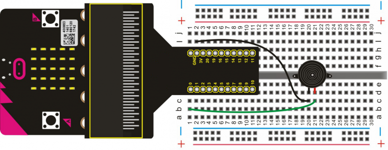

# Passive Buzzer

In this project, we will use micro:bit to drive a passive buzzer. Since the passive buzzer has no oscillator inside, DC signal can’t make it beep and you will need to use a square-wave to drive it.

## Required Components
Quantity | Component
--- | ---
1 | micro:bit
1 | T-type adapter
1 | USB cable
1 | Passive buzzer
1 | Breadboard
2 | Jumper wire

## Coding the micro:bit

Create or download the hex file, power up the unit & upload the code. You should be able to hear the buzzer playing the song of "Ode To Joy".

#### If you are having trouble coding the micro:bit, you can download a copy of the hex file below
[Download Hex File](https://github.com/Jaycar-Electronics/micro-bit-Starter-Kit/blob/master/Project%2011%20-%20Passive%20Buzzer/Passive-Buzzer.zip?raw=true)
