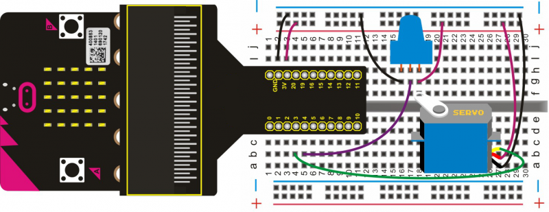
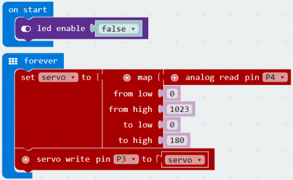

# Driving Servo Motor

In this project, we will use a potentiometer to adjust the turning angle of a servo. When rotating the knob on the potentiometer, the servo will turn.

## Required Components
Quantity | Component
--- | ---
1 | micro:bit
1 | T-type adapter
1 | USB cable
1 | 9G servo
1 | Potentiometer
1 | Breadboard
8 | Jumper wire

## Coding the micro:bit

Create or download the hex file, power up the unit & upload the code. You should be able to rotate the knob on the top of potentiometer and see the servo arm turn.

#### If you are having trouble coding the micro:bit, you can download a copy of the hex file below
[Download Hex File](https://github.com/Jaycar-Electronics/micro-bit-Starter-Kit/blob/master/Project%2012%20-%20Driving%20Servo%20Motor/Driving-Servo-Motor.zip?raw=true)
