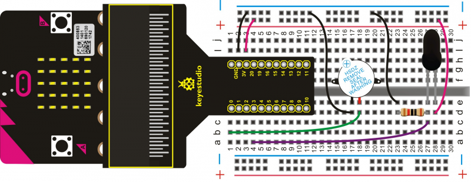
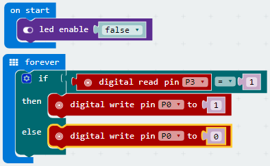

# Flame Alarm

In this project, we are going to control a buzzer through the use of a flame sensor. 

**Please note:** this project should only be attempted under adult supervision.

## Required Components
Quantity | Component
--- | ---
1 | micro:bit
1 | T-type adapter
1 | USB cable
1 | Flame sensor
1 | Active buzzer
1 | 10KΩ resistor
1 | Breadboard
8 | Jumper wire

## Coding the micro:bit

Create or download the hex file, power up the unit & upload the code. If the flame sensor detects a flame nearby, the active buzzer will beep.

**Please note:** this project should only be attempted under adult supervision.

#### If you are having trouble coding the micro:bit, you can download a copy of the hex file below
[Download Hex File](https://github.com/Jaycar-Electronics/micro-bit-Starter-Kit/blob/master/Project%2013%20-%20Flame%20Alarm/Flame-Alarm.zip?raw=true)
