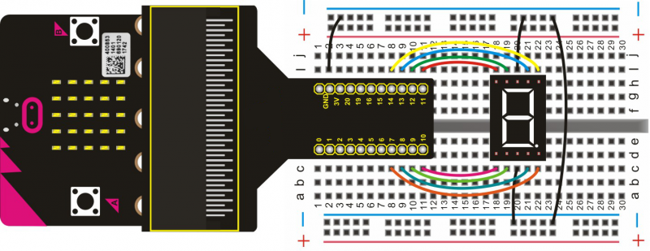
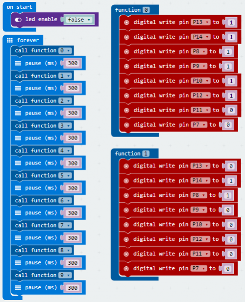
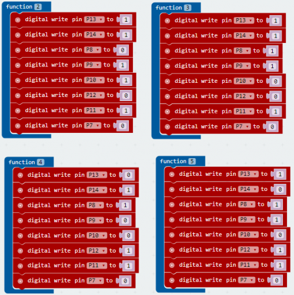
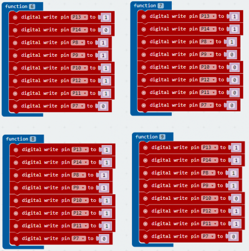

# 1-digit LED Display

We can control the display of a segmented LED segment display through controlling the high/low level of its interface. This time, we are going to use LED display to show numbers from 0 to 9.

## Required Components
Quantity | Component
--- | ---
1 | micro:bit
1 | T-type adapter
1 | USB cable
1 | 1digit LED display
1 | Breadboard
12 | Jumper wire

## Coding the micro:bit

Create or download the hex file, power up the unit & upload the code. You should be able to see the LED segment display showing the numbers from 0 to 9 circularly. 

#### If you are having trouble coding the micro:bit, you can download a copy of the hex file below
[Download Hex File](https://github.com/Jaycar-Electronics/micro-bit-Starter-Kit/blob/master/Project%2014%20-%201-digit%20LED%20Display/1digit-LED-Display.zip?raw=true)
