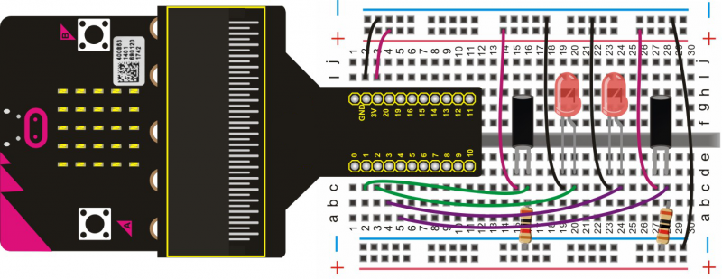
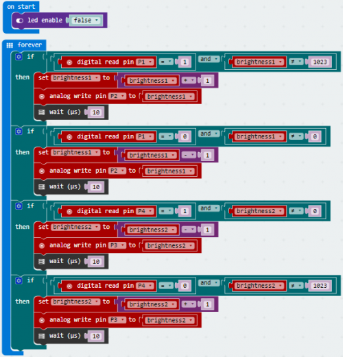

# Magical Light Cup

This project adopts the principle of using an analog value to regulate light brightness. The brightness of the two LEDs in the experiment will change when the ball tilt switch provides a digital signal to trigger analog value regulation.

## Required Components
Quantity | Component
--- | ---
1 | micro:bit
1 | T-type adapter
1 | USB cable
1 | Ball tilt switch
2 | LED
2 | 10KΩ resistor
1 | Breadboard
11 | Jumper wire

## Coding the micro:bit

Create or download the hex file, power up the unit & upload the code. Tilt the two switches to one side and you should see that one LED dims gradually while the other becomes gradually brighter.

#### If you are having trouble coding the micro:bit, you can download a copy of the hex file below
[Download Hex File](https://github.com/Jaycar-Electronics/micro-bit-Starter-Kit/blob/master/Project%2015%20-%20Magical%20Light%20Cup/Magical-Light-Cup.zip?raw=true)
