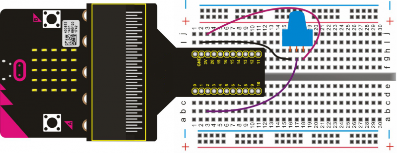

# micro:bit Analog Read

In this project, we will use a potentiometer to adjust the analog quantity of the analog pin. When rotating the potentiometer, the value will change and is displayed on the serial monitor. 

**Note:** This project uses the Arduino IDE.

## Required Components
Quantity | Component
--- | ---
1 | micro:bit
1 | T-type adapter
1 | USB cable
1 | Potentiometer
1 | Breadboard
3 | Jumper wire

## Coding the micro:bit

Create or download the hex file, power up the unit & upload the code. Open the Arduino IDE, set the COM port shown below. Then, open serial monitor & set the baud rate as 115200. You should begin to see the value output from the potentiometer.

#### If you are having trouble coding the micro:bit, you can download a copy of the hex file below
[Download Hex File](https://github.com/Jaycar-Electronics/micro-bit-Starter-Kit/blob/master/Project%2016%20-%20Microbit%20Analog%20Read/microbit-Analog-Read.zip?raw=true)
