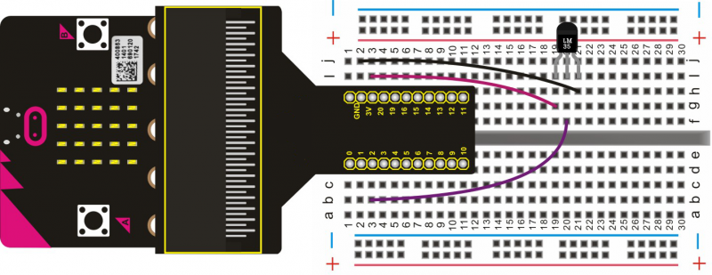
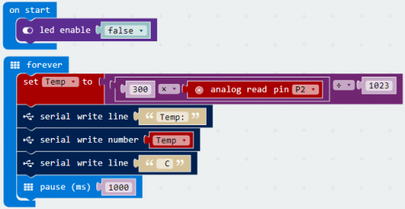
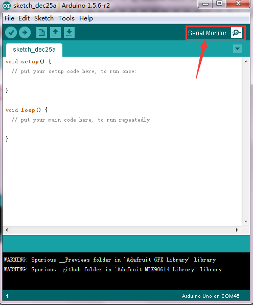

# LM35 Temperature Sensor

The LM35 temperature sensor can sense the current environmental temperature. In this project, it will convert the temperature into voltage, and input the voltage to the micro:bit. Finally, the result will be displayed on the serial monitor.  

**Note:** This project uses the Arduino IDE.

## Required Components
Quantity | Component
--- | ---
1 | micro:bit
1 | T-type adapter
1 | USB cable
1 | LM35 temperature sensor
1 | Breadboard
3 | Jumper wire

## Coding the micro:bit

Create or download the hex file, power up the unit & upload the code. Open the Arduino IDE, set the COM port shown below. Then, open serial monitor & set the baud rate as 115200. You should begin to see the value output from the temperature sensor.

#### If you are having trouble coding the micro:bit, you can download a copy of the hex file below
[Download Hex File](https://github.com/Jaycar-Electronics/micro-bit-Starter-Kit/blob/master/Project%2018%20-%20LM35%20Temperature%20Sensor/LM35-Temperature-Sensor.zip?raw=true)
