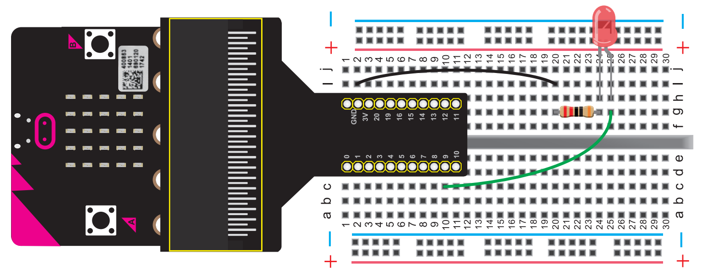
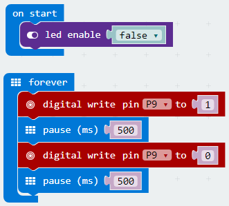

# Blinking an LED

In this project we are going to create a blinking LED using an eternal light.

## Required Components
Quantity | Component
--- | ---
1 | micro:bit
1 | T-type adapter
1 | USB cable
1 | LED
1 | 220Ω resistor
1 | Breadboard
2 | Jumper wire

## Coding the micro:bit

Create or download the hex file, power up the unit & upload the code. You should be able to see the external LED light blinking.

#### If you are having trouble coding the micro:bit, you can download a copy of the hex file below
[Download Hex File](https://github.com/Jaycar-Electronics/micro-bit-Starter-Kit/blob/master/Project%202%20-%20Blinking%20an%20LED/Blinking-LED.zip?raw=true)
