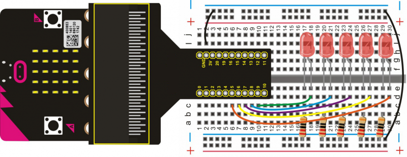
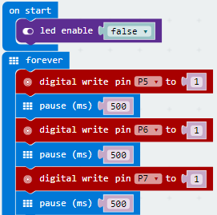
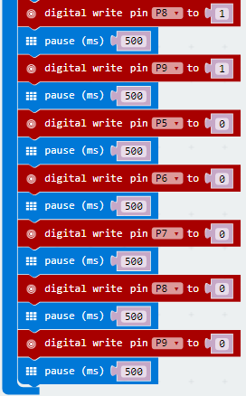

# Simulating an Advertising Light

In daily life, you may often see some advertising boards composed of various LED lights. Different LED lights on the advertising board can form an amazing lighting effect. In this lesson, we will use LED light program to simulate an advertising light, brightening and dimming the lights one at a time.

## Required Components
Quantity | Component
--- | ---
1 | micro:bit
1 | T-type adapter
1 | USB cable
5 | LED
5 | 220Ω resistor
1 | Breadboard
7 | Jumper wire

## Coding the micro:bit

Create or download the hex file, power up the unit & upload the code. You will be able see the external LED lights connected brightening, and then dimming one by one circularly.

#### If you are having trouble coding the micro:bit, you can download a copy of the hex file below
[Download Hex File](https://github.com/Jaycar-Electronics/micro-bit-Starter-Kit/blob/master/Project%203%20-%20Simulating%20Advertising%20Light/Simulating-Advertising-Light.zip?raw=true)
