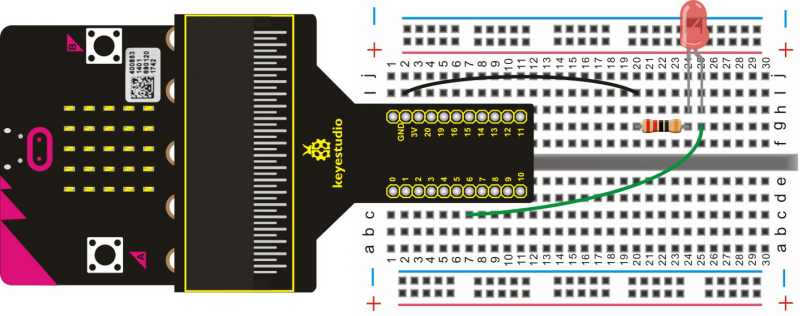
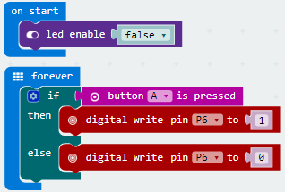

# Button Controlled LED

Micro:bit has three built-in buttons; two for user buttons (labelled A and B) and one for resetting the board. In this project we are going to use a button on the micro:bit to turn an external LED on and off. 

## Required Components
Quantity | Component
--- | ---
1 | micro:bit
1 | T-type adapter
1 | USB cable
1 | LED
1 | 220Ω resistor
1 | Breadboard
2 | Jumper wire

## Coding the micro:bit

Create or download the hex file, power up the unit & upload the code. When pressing down the button A on the micro:bit, LED on; if not, LED off.
#### If you are having trouble coding the micro:bit, you can download a copy of the hex file below
[Download Hex File](https://github.com/Jaycar-Electronics/micro-bit-Starter-Kit/blob/master/Project%204%20-%20Button%20Controlled%20LED/Button-Controlled-LED.zip?raw=true)
