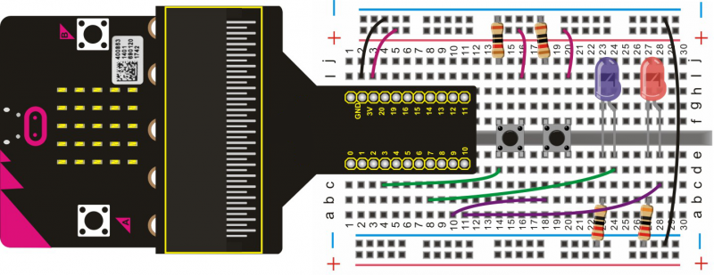

# Making a Responder

We have used the micro:bit built-in button to control an LED light in a previous experiment. This time, we will use it to make a responder by using built-in button on micro:bit as a reset button, while two tactile buttons will function as responders to control two external LEDs.

## Required Components
Quantity | Component
--- | ---
1 | micro:bit
1 | T-type adapter
1 | USB cable
2 | LED
2 | Tactile button
2 | 220Ω resistor
2 | 10KΩ resistor
1 | Breadboard
9 | Jumper wire

## Coding the micro:bit

Create or download the hex file, power up the unit & upload the code. Press down the A button on micro:bit to restart and use the two buttons to turn the two LED lights off.
#### If you are having trouble coding the micro:bit, you can download a copy of the hex file below
[Download Hex File](https://github.com/Jaycar-Electronics/micro-bit-Starter-Kit/blob/master/Project%205%20-%20Making%20a%20Responder/Making-a-Responder.zip?raw=true)
