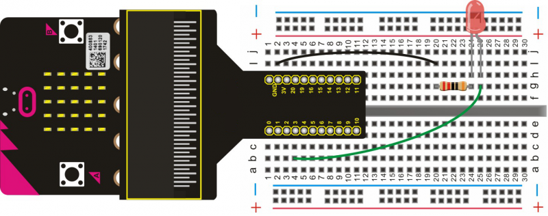
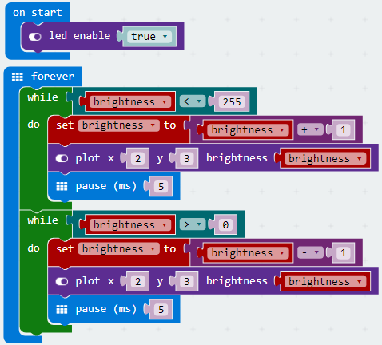
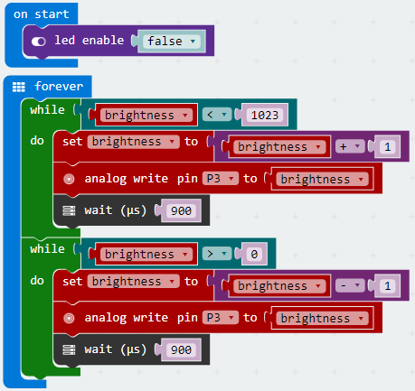

# Breathing LED

Learn to control LED brightness using the micro:bit code. We are going to control LED on and off gradually which simulates breathing. 

## Required Components
Quantity | Component
--- | ---
1 | micro:bit
1 | T-type adapter
1 | USB cable
1 | LED
1 | 220Ω resistor
1 | Breadboard
2 | Jumper wire

## Coding the micro:bit
### Using the 5*5 matrix on the micro:bit

### Using an extrnal LED (as pictured in the circuit diagram)

Create or download the hex file, power up the unit & upload the code. The LED should gradually dim and then brighten in a breathing pattern.
#### If you are having trouble coding the micro:bit, you can download a copy of the hex file below
[Download Hex File - 5*5 Matrix](https://github.com/Jaycar-Electronics/micro-bit-Starter-Kit/blob/master/Project%206%20-%20Breathing%20LED/Breathing-LED-1.zip?raw=true)

[Download Hex File - External LED](https://github.com/Jaycar-Electronics/micro-bit-Starter-Kit/blob/master/Project%206%20-%20Breathing%20LED/Breathing-LED-2.zip?raw=true)
