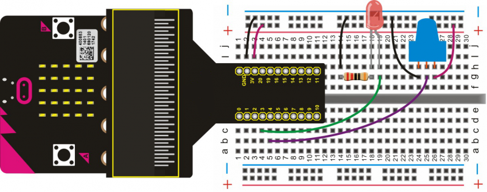

# Controlling LED Brightness

In this lesson, you will learn how to use a potentiometer to control the brightness of an LED. 

## Required Components
Quantity | Component
--- | ---
1 | micro:bit
1 | T-type adapter
1 | USB cable
1 | LED
1 | 220Ω resistor
1 | Potentiometer
1 | Breadboard
7 | Jumper wire

## Coding the micro:bit

Create or download the hex file, power up the unit & upload the code. You can adjust the brightness of the LED by rotating the knob on the potentiometer.
#### If you are having trouble coding the micro:bit, you can download a copy of the hex file below
[Download Hex File](https://github.com/Jaycar-Electronics/micro-bit-Starter-Kit/blob/master/Project%207%20-%20Controlling%20LED%20Brightness/Controlling-LED-Brightness.zip?raw=true)
