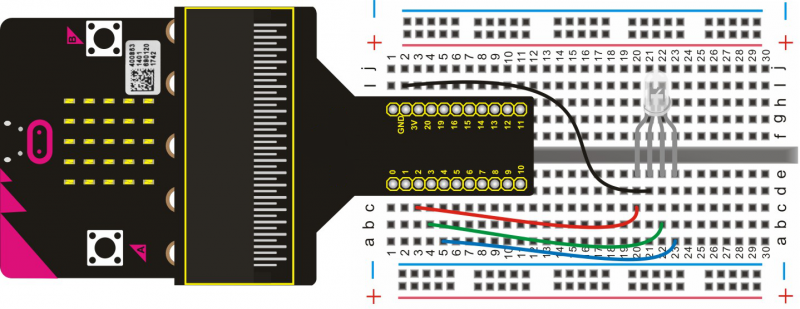
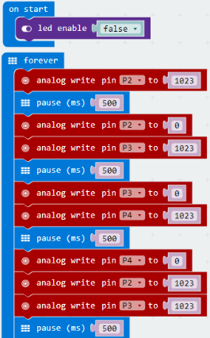
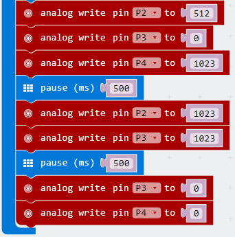

# RGB LED

In this lesson, we will use an RGB light to achieve a full-color mixing effect, through controlling the voltage input of R、G、B pins.

## Required Components
Quantity | Component
--- | ---
1 | micro:bit
1 | T-type adapter
1 | USB cable
1 | RGB LED
1 | Breadboard
4 | Jumper wire

## Coding the micro:bit

Create or download the hex file, power up the unit & upload the code. You should be able to see the RGB LED continue to emit the red light for 1S, the green light for 1S, the blue light for 1S, the yellow light for 1S, the purple light for 1S, & finally white light for 1S before repeating.

#### If you are having trouble coding the micro:bit, you can download a copy of the hex file below
[Download Hex File](https://github.com/Jaycar-Electronics/micro-bit-Starter-Kit/blob/master/Project%208%20-%20RGB%20LED/RGB-LED.zip?raw=true)
