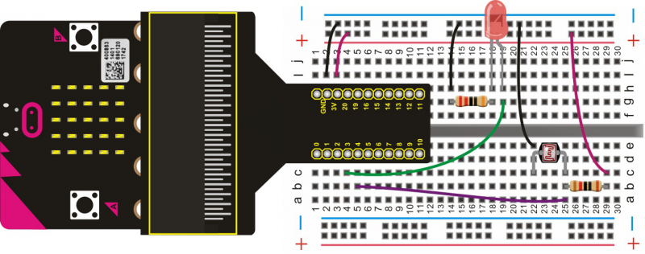

# Photosensitive Light

In this experiment, you can learn from the LED brightness controlled by potentiometer, just replace the potentiometer with photocell to achieve the effect that the brightness of LED will be changed once light intensity is different.

## Required Components
Quantity | Component
--- | ---
1 | micro:bit
1 | T-type adapter
1 | USB cable
1 | LED
1 | 220Ω resistor
1 | 5mm photocell
1 | 10Ω resistor
1 | Breadboard
7 | Jumper wire

## Coding the micro:bit

Create or download the hex file, power up the unit & upload the code. You should be able to see that the higher the light that the photocell senses, the duller the LED; the lower the light the photocell senses, the brighter the LED.

#### If you are having trouble coding the micro:bit, you can download a copy of the hex file below
[Download Hex File](https://github.com/Jaycar-Electronics/micro-bit-Starter-Kit/blob/master/Project%209%20-%20Photosensitive%20Light/Photosensitive-Light.zip?raw=true)
