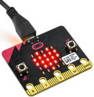
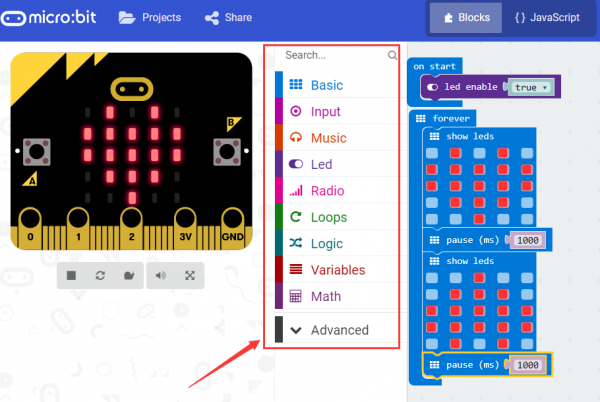
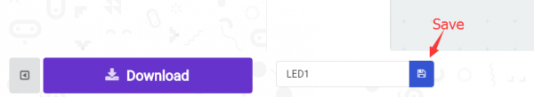
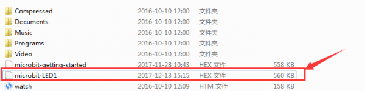
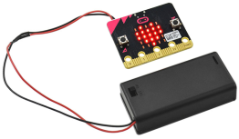

# micro:bit First Time Use

## Required Components
Quantity | Component
--- | ---
1 | micro:bit
1 | USB cable

## Step 1 - Connecting the micro:bit

Connect the micro:bit to your computer via a micro USB cable. Your micro:bit will show up on your computer as a drive called 'MICROBIT'. 

Create or download the hex file, power up the unit & upload the code. Within the Arduino IDE, set the COM port, open the serial monitor, select the baud rate 115200 (because the baud rate of a micro:bit is 115200), type “R” on the keyboard, then click “Send”. You should see the monitor display “Hello world!”. Shown below.

## Step 2 - Programming your micro:bit

Using the [micro:bit MakeCode Block editor] (https://makecode.microbit.org/), write your first micro:bit code. You can drag and drop some example blocks and try your program on the Simulator in the Javascript Blocks Editor.

Click the Download button in the editor. This will download a 'hex' file, which is a compact format of your program that your micro:bit can read. Here you can name the project as LED1, then click “Save”. Shown below. 

Once the hex file has downloaded, copy it to your micro:bit just like copying a file to a USB drive. On Windows find the microbit-LED1 file, you can right click and choose "Send To→MICROBIT." 

## Step 3 - Test your code

The micro:bit will pause and the yellow 5*5 LED on the back of the micro:bit will display the images while your code is programmed. 

You can power it using USB cable or battery. The battery holder requires 1.5V AA batteries.

